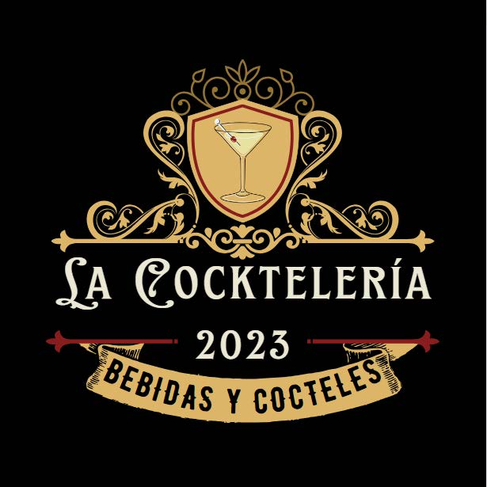

    

## La Cocktelería 🍹
- Este es un proyecto realizado para el curso de Codo a Codo FullStack Python
- Es un sitio web para informar sobre la preparación de tragos, bebidas y cócteles.

## Link ✅
https://la-cockteleria.vercel.app/
## Recursos Externos 🌍
- Uso de la API de Google Maps para mostrar la ubicación en la página de contacto.
- Uso de la API de externa que provee información de bebidas y tragos (https://www.thecocktaildb.com/).
- Uso de FormSubmit para el envío de formularios.

## Tecnologías utilizadas 💻

* __Javascript__
* __HTML__
* __CSS__ 
* __Bootstrap__

## Integrantes 🧑‍💻👩‍💻👨‍💻👨‍💻
* __Eduardo Salinas__
* __Nicolás Fratantueno__
* __Juan Gerardo Romero Uro__
* __Cecilia Dominguez__

## Profesor y Comision 👨‍🏫 
__Carlos Arroyo__
__Comisión: 23518 - Grupo 18 - Año 2023 - 2do cuatrimestre__

